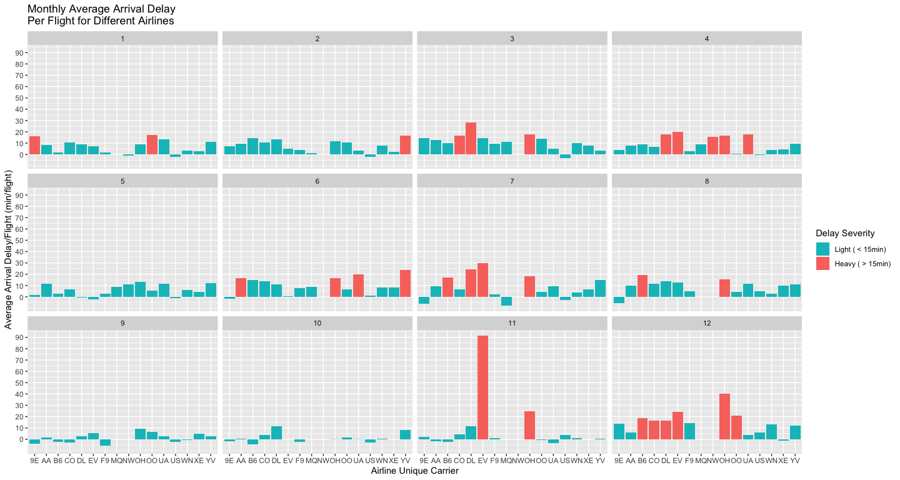
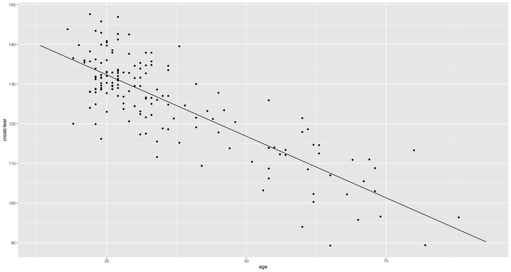
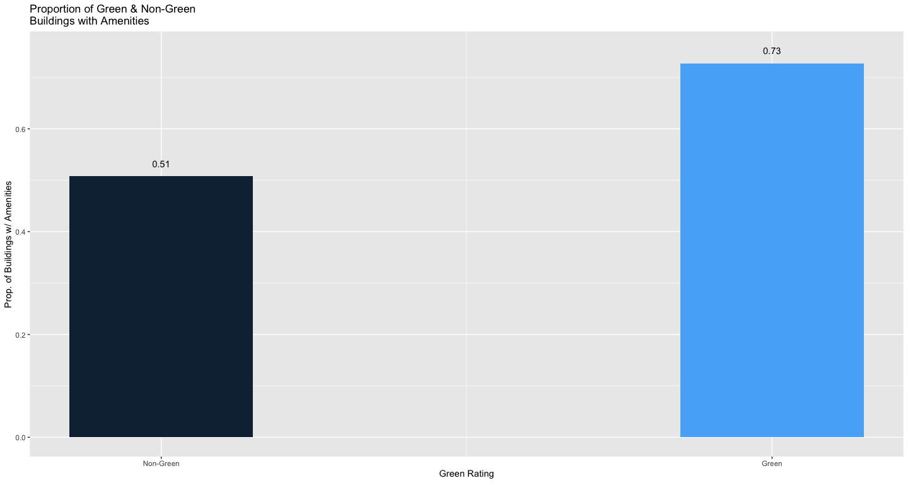
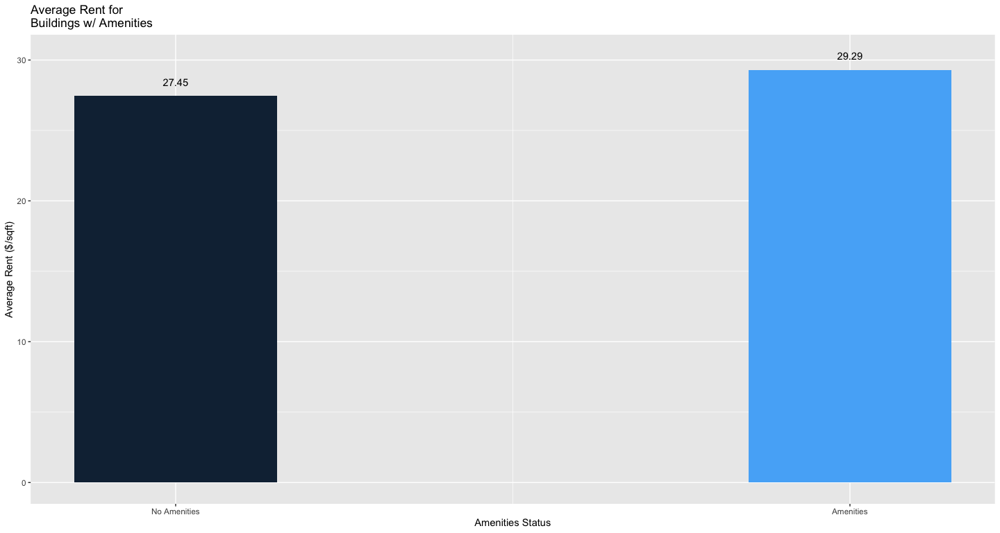
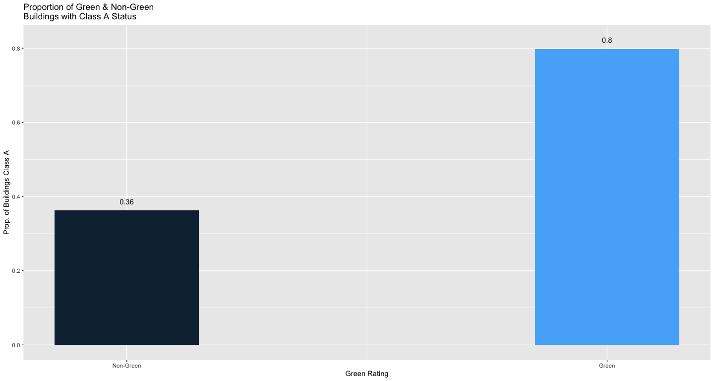
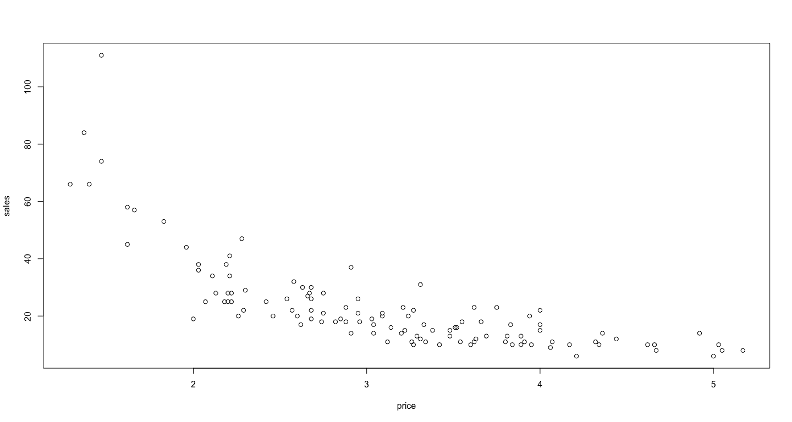
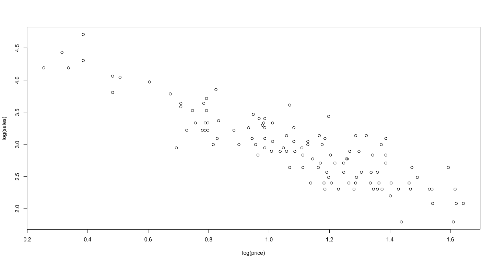
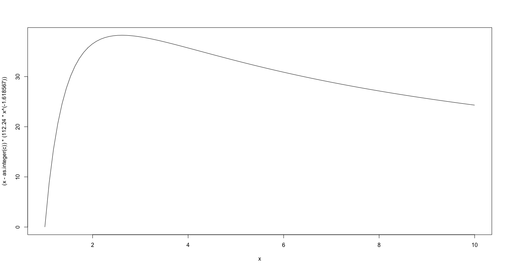

Exercise1 Solutions
================

## ABIA: Data visualization: flights at ABIA

The dataset used in this problem contained information related to every
commercial flight in 2008 that either departe dfrom or landed at
Austin-Bergstrom Internatinoal Airport (ABIA).

The questions proposed was the following: **for any given month in 2008,
which is the best airline to fly to minimize delays?**

The libraries shown below were utilized for all parts of Exercise 1.

``` r
library(mosaic)
library(tidyverse)
```

The plot for observing the results are shown below.

<!-- -->

## Regression practice

The following questions were addressed with utilizing the creatinine.csv
file.

1.  What creatinine clearance rate should we expect, on average, for a
    55-year-ol?
2.  How does creatinine clearance rate change with age? (This should be
    a number with units ml/minute per year.)
3.  Whose creatinine clearance rate is healthier (higher) for their age:
    a 40-year-old with a rate of 135, or a 60-year-old with a rate of
    112?

#### Problem 1:

``` r
new_data = data.frame(age = c(55))
predict(lrm, new_data)
```

    ##       1 
    ## 113.723

For a 55-year-old, we expected a creatinine clearance rate of about
113.723 mL/minute.

#### Problem 2:

``` r
coef(lrm)
```

    ## (Intercept)         age 
    ## 147.8129158  -0.6198159

For every one year increase in age, creatinine clearance rate is
expected to drop by an average of about 0.6198159 mL/minute.

#### Problem 3:

``` r
new_data = data.frame(age = c(40))
predict(lrm, new_data)
```

    ##        1 
    ## 123.0203

``` r
new_data = data.frame(age = c(60))
predict(lrm, new_data)
```

    ##       1 
    ## 110.624

According to the regression model, a 40-year-old with a rate of 135 is
healthier (higher) than a 60-year-old with a rate of 112. The rate of
135 mL/min is significantly higher than the predicted rate of 123.0203
mL/min for an age of 40 years old. This is better than the rate of 112
mL/min compared to a predicted rate of 110.624 mL/min for an age of 60
years old. The following is a plot of clearance rate vs. age, along with
the fitted model used to reach the aforementioned
conclusions.

<!-- --><!-- -->

## Green buildings

The question was to evaluate the conclusions found in the report
provided and explain whether we agree or disagree with the method of
analysis, where it went wrong, and how it can be improved.

To approach this problem, the possibility of confounding variables
impacting the market rent rate outside of the ‘green\_rating’ were
explored. Three dichotomous categorical variables were considered from
the dataset: amenities, class\_a, and class\_b statues.

The respective code used to explore each categorical variable is shown
below.

#### Amenities

##### Part 1: Tabulate comparisons for the categorical variable

``` r
xtabs(~amenities + green_rating, data=greenbuildings) %>%
  prop.table(margin=2)
```

    ##          green_rating
    ## amenities         0         1
    ##         0 0.4924400 0.2729927
    ##         1 0.5075600 0.7270073

The contingency table shows the proportion of buildings with/without
amenities and are non-green/green rated.

``` r
pct_green_amen = greenbuildings %>%
  group_by(green_rating) %>%
  summarize(pct_amen = sum(amenities==1)/n())
pct_green_amen
```

    ## # A tibble: 2 x 2
    ##   green_rating pct_amen
    ##          <dbl>    <dbl>
    ## 1            0    0.508
    ## 2            1    0.727

The table above shows what proportion of buildings that have amenities
are non-green and green rated. A much larger proportion of green-rated
buildings have amenities (0.727) versus non-green rated buildings
(0.508).

``` r
avg_rent_amen = greenbuildings %>%
  group_by(amenities) %>%
  summarize(mean_rent = mean(Rent,na.rm=TRUE))
avg_rent_amen
```

    ## # A tibble: 2 x 2
    ##   amenities mean_rent
    ##       <dbl>     <dbl>
    ## 1         0      27.5
    ## 2         1      29.3

The table above shows the average rent rate ($/sqft) for buildings with
and without amenities. The average market rent rate of buildings with
amenities is larger by 1.80USD/sqft. Those with amenities charge an
average rent rate of 29.30USD versus those without charge 27.50USD.

##### Part 2: Plot both the relationships in bar charts

<!-- --> Plot
displaying the proportion of buildings with amenities that are non-green
rated and green rated.

<!-- --> Plot
displaying the average market rent rates for buildings with and without
amenities.

From studying the building amenities variable, it was discovered that a
large proportion of green buildings also have amenities, which on
average charge higher market rent rates. This suggests amenities may be
a confounding variable.

#### Class A

##### Part 1: Tabulate comparisons for the categorical variable

``` r
xtabs(~class_a + green_rating, data=greenbuildings) %>%
  prop.table(margin=2)
```

    ##        green_rating
    ## class_a         0         1
    ##       0 0.6378138 0.2029197
    ##       1 0.3621862 0.7970803

The contingency table shows the proportion of buildings with/without
class A status and are non-green/green rated.

``` r
pct_green_classA = greenbuildings %>%
  group_by(green_rating) %>%
  summarize(pct_classA = sum(class_a==1)/n())
pct_green_classA
```

    ## # A tibble: 2 x 2
    ##   green_rating pct_classA
    ##          <dbl>      <dbl>
    ## 1            0      0.362
    ## 2            1      0.797

The table above shows what proportion of buildings that have class A
status are non-green and green rated. A much larger proportion of
green-rated buildings have class A status (0.797) versus non-green rated
buildings (0.362).

``` r
avg_rent_classA = greenbuildings %>%
  group_by(class_a) %>%
  summarize(mean_rent2 = mean(Rent,na.rm=TRUE))
avg_rent_classA
```

    ## # A tibble: 2 x 2
    ##   class_a mean_rent2
    ##     <dbl>      <dbl>
    ## 1       0       25.8
    ## 2       1       32.3

The table above shows the average rent rate ($/sqft) for buildings with
and without class A status. The average market rent rate of buildings
with class A status is larger by 6.50USD/sqft. Those with class A status
charge an average rent rate of 32.30USD versus those without charge
25.8USD.

##### Part 2: Plot both the relationships in bar charts

<!-- -->

<!-- -->

#### Class B

##### Part 1: Tabulate comparisons for the categorical variable

``` r
xtabs(~class_b + green_rating, data=greenbuildings) %>%
  prop.table(margin=2)
```

    ##        green_rating
    ## class_b         0         1
    ##       0 0.5151893 0.8072993
    ##       1 0.4848107 0.1927007

The contingency table shows the proportion of buildings with/without
class B status and are non-green/green rated.

``` r
pct_green_classB = greenbuildings %>%
  group_by(green_rating) %>%
  summarize(pct_classB = sum(class_b==1)/n())
pct_green_classB
```

    ## # A tibble: 2 x 2
    ##   green_rating pct_classB
    ##          <dbl>      <dbl>
    ## 1            0      0.485
    ## 2            1      0.193

The table above shows what proportion of buildings that have class B
status are non-green and green rated. A much larger proportion of
non-green rated buildings have class B status (0.485) versus green-rated
buildings (0.193).

``` r
avg_rent_classB = greenbuildings %>%
  group_by(class_b) %>%
  summarize(mean_rent3 = mean(Rent,na.rm=TRUE))
avg_rent_classB
```

    ## # A tibble: 2 x 2
    ##   class_b mean_rent3
    ##     <dbl>      <dbl>
    ## 1       0       30.1
    ## 2       1       26.4

The table above shows the average rent rate ($/sqft) for buildings with
and without class B status. The average market rent rate of buildings
with class B status is lower by 3.70USD/sqft. Those with class B status
charge an average rent rate of 26.40USD versus those without charge
30.10USD.

<!-- -->

<!-- -->

From studying the building class status (A or B), it was discovered that
a much larger proportion of green buildings had class A status, which on
average had a larger rental rate by $6.50/sqft. Furthermore, a larger
proportion of non-green buildings had class B status, which on average
had a lower rental rate by 3.70 dollars/sqft.

#### Conclusion

Together, the results suggest that other variables also influenced the
market rental rate of buildings, and that the higher market rental rate
of green buildings compared to non-green buildings may not just be
attributed to green rating. Rather, the presence of amenities, class A,
or class B status also influenced the market rental rate. ALthough the
ultimate conclusion is the same, the method of data analysis the
“data-guru” conducted was not necessarily fully correct in claiming a
sole relationship between market rental rate and green rating.

## Milk prices

The first step to the problem was to write an equation modeling the
relationship between Net Profit (N), Price (P), Quanity Demanded (Q),
and Unit Cost (c). The following equation was determined.

\[\frac{N}{P-c} = Q\]

Because Q is a f(P), the next step was to identify the relationship
between Q(P) and P. Using the dataset, we constructed a plot of sales
versus price. The plot suggested a power regression relationship, so a
log-scale plot was produced to linearize the data and identify a
relationship. From the linear model, the logarithmic parameters were
rearranged to yield a power law form. From the curve, the following
equation was determined for as the linearized model.

\[
ln(Q) = 4.720604 - 1.618578*ln(P)
\]

<!-- --><!-- -->

From this equation, the power relationship between Sales (Q) and Price
(P) was found to be

\[
Q = 112.236*P^{-1.618567}
\]

Plugging this back into the original Net Profit equation yields

\[
N = (P - c)(112.236*P^{-1.618567})
\]

To solve for the optimal price, the derivative \[
\frac{dN}{dP} = \frac{-69.59*(P-2.6129c)}{x^(2.62)}
\]

is set equal to 0 to find the local maximum of the curve. Thus, the
final equation to find the profit maximizing price \[(P)\] given a unit
cost \[(c)\] is the following

\[
P = 2.6129*c
\]

<!-- -->

    ## [1] "Optimal Price: 2.61292"
